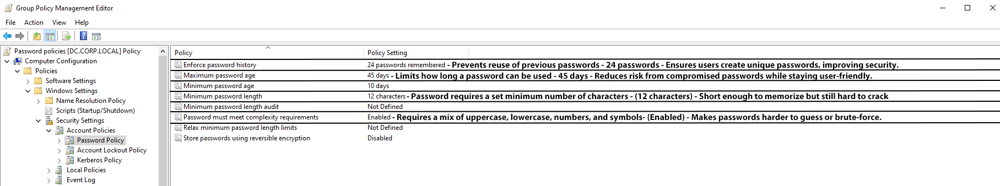
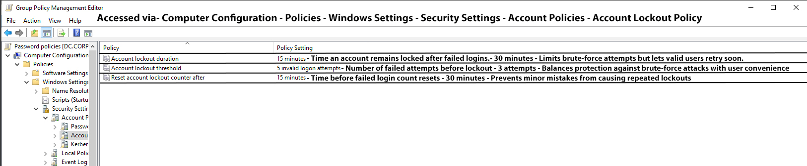

# Group Policies

Group Policy (GPO) is a Windows feature that lets administrators centrally manage and configure settings for users and computers across a network. GPOs work within Active Directory (AD) and can be linked to domains, sites, or Organizational Units (OUs)—for example, different departments like HR, Sales, or IT—to control which users or devices receive specific policies. Their main purpose is to enforce security, standardize configurations, and automate management.

Key Features:

. User & Computer Configuration: Apply settings to users, computers, or both.

. Security Enforcement: Password policies, account lockouts, firewall rules.

. Software Deployment & Scripts: Automatically install software or run scripts at login/startup.

. Administrative Templates & Folder Redirection: Standardize desktop, application, and folder settings.

. Policy Inheritance & Filtering: Control which policies apply through AD hierarchy and security groups.

## Existing GPOs

### Password related GPOs- Click to enlarge

### Account Lockout related GPOs- Click to enlarge

